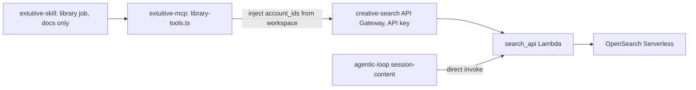

# Library: reading what was uploaded

Design for the next tier of the Extuitive skill and MCP server. Status: built on feature
branches in all three repos (2026-09-10), not yet merged or deployed to dev.

## The gap

After an upload settles, the agent knows `contentId`, filename, media kind, byte count, and a
thumbnail URL on a `READY` image. It does not know what the pixels show or what a video says.

The creative index already knows. Every uploaded image and, as of EXT3-149 (2026-09-08),
every uploaded video is embedded with SigLIP2 and annotated with Gemini: overlay text, visual
tags, foreground / background / holistic prose, and for video the transcript, hook, duration,
and audio type. None of it reaches an agent using this skill.

Creative distance ([EXT3-150](https://linear.app/extuitive-team/issue/EXT3-150)) is the
wrong next step. It is a judgment over two distributions per live ad set. An agent cannot
form that judgment about a file it has never read. Describe comes first.

## Who asks, and what they say

Someone in Cursor, Codex, or Claude with a folder of exports on disk.

- "Upload `sept-drop` to Acme, then tell me what's in it."
- "Which of these are the same ad in different sizes?"
- "Have we uploaded something like this before?"
- "Find the talking-head videos we sent last month."
- "The ones with the product on white."

Later, not now: "What's running?", "Has this exact image run before, how did it do?",
"Is this different enough from what's live?", "Will this work?"

## What the index adds that the agent's own eyes do not

The agent can look at a local image itself. The index earns its place in three cases:

1. **Video.** The agent cannot watch a clip. Transcript, hook, duration, and `audio_type`
   only exist in the index.
2. **The account's vocabulary.** Every asset on the account is described with the same tag
   set and prompt. Reading an upload in that vocabulary is what makes "more like this"
   comparable at all.
3. **Things not on disk.** Other batches, other people's uploads to the same workspace, and
   eventually the ads Meta served.

So the job is less "describe my file" and more "situate my files against the library".

## Scope of PR 1: the uploaded library

Corpus: assets that arrived through `create_upload_batch` on this workspace. Nothing Meta
served, nothing live, no performance. Every tool forces `uploaded_only`.

| Tool | Answers | Index route |
| --- | --- | --- |
| `describe_content` | What is in these files | `/asset` with `content_ids[]` |
| `group_content_variants` | Which files are one ad at several aspect ratios | `/variants` |
| `find_similar_content` | Have we uploaded something like this | `/similar`, `uploaded_only` |
| `search_content` | Uploads matching a description or a time window | `/attributes`, `uploaded_only` |

All read-only. All fenced server-side. None returns a judgment.

### `describe_content(workspaceId, contentIds[], fields?)`

Batched, because a batch is the unit the person thinks in. One entry per requested id, in
one of three states:

| State | Meaning | What the agent says |
| --- | --- | --- |
| `indexed` | Document present | Summarize it |
| `not_indexed_yet` | A content row exists (its `uploadStatus` is returned), no asset document | "Still being read; video takes minutes" — unless `uploadStatus` is `REJECTED`, then "never will be" |
| `unknown` | Not a `contentId` in this workspace | "No such upload here" |

Three states because the agent needs to say three different things, the same way
`upload-status` separates "still arriving" from "never arrived".

Default `fields`: `media_type`, `on_screen_text`, `visual_tags`, `holistic_description`;
for video also `duration_seconds`, `transcript_hook`, `hook_holistic_description`,
`hook_on_screen_text`, `audio_type`, `has_speech`. Full `transcript`,
`foreground_description`, `background_description` on request. Handles
(`meta_image_hashes`, `meta_video_ids`, `ad_ids`) only when asked; they belong to other jobs.

Raw index fields, filtered by an allowlist. Not a rewritten summary. The skill's rule holds:
say what the tool returned, not what it implies.

### `group_content_variants(workspaceId, batchId)`

Wraps `/variants`. Returns groups with `anchor` (the 1:1 member), members keyed by aspect
bucket, and `ungrouped_no_dimensions` so the agent can tell "waiting on embedding" from
"genuinely alone". Turns thirty files into ten ads before anything else happens.

### `find_similar_content(workspaceId, contentId, k?, vectorKind?)`

Wraps `/similar`. Query is always a `contentId` the agent already holds, never a raw vector.
`vectorKind: hook` is "opens like this"; default is the whole creative. Neighbors and scores.
No diversity boolean.

### `search_content(workspaceId, text?, tags?, mediaType?, uploadedSince?, batchId?)`

Wraps `/attributes`. Tags match all by default. Recency sort only when there is no text
query; a text query has relevance to rank by.

## The job, as the agent runs it

```
upload         manifest: filename -> contentId -> status
upload-status  until every row settles
library        describe READY ids; some are not_indexed_yet, keep the rest, retry later
               group variants on the batch
               summarize per ad, in the index's words
               stop and ask
```

Step five is where the person sees value:

> Six ads. Four stills, two videos. Video 1 is 32s, talking head, opens on "I stopped
> buying..." and the product appears at 0:04. Video 2 is 15s, music only, price overlay in
> the first frame. Two stills are the same shot at 1:1 and 9:16.

Identity mapping is the agent's real work. The person says "the hero shot", the agent has
`hero_1x1.png` on disk, the upload returned a `contentId` for that filename, every index call
takes the `contentId`. The batch manifest is the spine of the conversation.

## Where each piece lives



Search stays in `aws-data-platform` with the index it queries. The fence is injected by the
MCP server, which knows the workspace. This repo gets docs only.

### Where the MCP server actually is

`https://www.extuitive.com/mcp` is `app/mcp/route.ts` in
[fl100inc/extuitive-mcp](https://github.com/fl100inc/extuitive-mcp), a Next.js BFF on Vercel
with Supabase auth and OAuth. It started as `lead-magnet` (MCP added 2026-09-02 to 09-04,
PRs #245 to #255), was copied to `extuitive-mcp` on 2026-09-05, and every commit since is
there. Tools are one array in `src/lib/mcp/tools/index.ts`; today `workspace-tools.ts`,
`meta-tools.ts`, `upload-tools.ts`, `meta-object-tools.ts`.

The server already maps workspace to `facebookAdAccountId` (`src/lib/mcp/workspaces.ts`) and
already calls agentic-loop server-side for uploads. Library tools follow the same pattern.
They go over HTTP to the Gateway with the API key, because Vercel is outside the AWS account;
`session-content`'s direct-invoke shortcut does not apply.

Note: `extuitive-mcp` carries its own `skills/bulk-upload/SKILL.md`, separate from this
repo's skill. Reconcile when `library` lands or the two drift.

## Changes per repo

### aws-data-platform, `dataops/creative-index-pipeline`

- `lambdas/search_api/handler.py`, `route_asset`: accept `content_ids[]` alongside
  `asset_sha256`. Return one entry per requested id, in order, as `indexed` or `not_found`;
  never a 400 on a miss. Default `fields` is the describe set; unknown names are a 400
  naming the allowlist; cap 50. The index cannot tell `not_indexed_yet` from `unknown`: its
  ledger is keyed on sha, not content id, so that split is the MCP's.
- `lib/creative-index-stack.ts`, `SearchApiGateway`: add `variants` to the resource list.
  The Lambda routes it; the Gateway did not expose it. A key that omits `knn-performance`
  is not possible with one usage plan; revisit if the analysis routes need gating.
- `scripts/check_describe.py`: offline checks plus `--live` against the dev Gateway.

### extuitive-mcp

- `src/lib/mcp/library.ts`: the module. Membership guard, then the workspace's `act_` ad
  account written into the body last as `account_ids`; per-route field allowlist drops any
  caller-supplied `account_ids` / `mca_ids` / `uploaded_only` / `meta_status` / `vector`;
  `uploaded_only` forced on `variants`, `similar`, `attributes`. Responses trimmed of ad and
  Meta handles and the tenant lists. Env `CREATIVE_SEARCH_URL`, `CREATIVE_SEARCH_API_KEY`.
- `src/lib/mcp/tools/library-tools.ts`: the four tools, registered in
  `src/lib/mcp/tools/index.ts` between the upload and Meta-object tools.
- `describe_content` turns the index's `not_found` into `not_indexed_yet` (a content row
  exists; its `uploadStatus` is returned) or `unknown` (no row) via `getMcpUploadContent`,
  one read per miss.

### extuitive-skill (this repo), docs only

- `skills/extuitive/SKILL.md`: sixth row, `library`, "What does this file contain, or find
  uploads like it or about it".
- `skills/extuitive/references/library.md`: the procedure above. Video reads take minutes;
  `not_indexed_yet` is the normal first answer; do not retry in a loop, do not guess from
  filenames.
- `skills/extuitive/references/tools.md`: four new tool entries, the three describe states,
  the `uploaded_only` invariant.
- `skills/extuitive/references/upload-status.md`: one line pointing at `library` once a batch
  settles.
- `src/constants.mjs`: `SKILL_COMMANDS` gains `library`.

None of the skill edits land until the MCP tools exist. A job that names tools the server
does not have is worse than no job.

## Environment

Everything in PR 1 targets **dev** in all three repos. Zack is standing that up now.

| Repo | Dev target | What PR 1 needs from it |
| --- | --- | --- |
| aws-data-platform | `CreativeIndexStack` dev: `dev-creative-index-search-api`, Gateway `dev-creative-search` | `variants` exposed; `/asset` accepts `content_ids[]`; API key issued to the MCP |
| extuitive-mcp | Dev deployment of the BFF, pointed at agentic-loop dev content tables | `CREATIVE_SEARCH_URL` and `CREATIVE_SEARCH_API_KEY` in dev env; library tools registered |
| extuitive-skill | `npx extuitive install --endpoint <dev MCP url>` | Nothing to deploy; docs land once the dev MCP lists the tools |

The upload announcement already flows in dev (`creativeIndexBusName: dev-creative-index-bus`
in agentic-loop's `cdk.json`); uploaded images and video are indexed there today. No prod
resources are touched.

### Dev MCP

`https://extuitive-mcp-git-development-extuitive.vercel.app` is the `development` branch
deployment of `extuitive-mcp`. Checked 2026-09-10 16:08 ET: the deployment is up but behind
Vercel Deployment Protection. Unauthenticated `POST /mcp` returns `401 Protected deployment`
with `vercel_auth_enabled: true`, and `/.well-known/oauth-*` redirects to the Vercel SSO
page rather than serving metadata. An MCP client cannot complete the OAuth discovery through
that, so before the skill can point at dev one of these has to happen:

- Turn Deployment Protection off for the `development` branch, or
- Issue a protection bypass token and have the skill's `--endpoint` flow pass it as
  `x-vercel-protection-bypass`.

### Dev search Gateway

Verified 2026-09-10 16:35 ET, account `479929096786`, `us-east-1`:

| Resource | State |
| --- | --- |
| `CreativeIndexStack` | `UPDATE_COMPLETE`, 2026-09-08 21:33 UTC |
| Lambda `dev-creative-index-search-api` | Active, last modified 2026-09-08 21:34 UTC |
| Gateway `dev-creative-search` | id `esfatsn1o8`, stage `v1` |
| AOSS `dev-creative-index` | ACTIVE |

Base URL is `https://esfatsn1o8.execute-api.us-east-1.amazonaws.com/v1/creative-search`.
Routes hang off `/creative-search/`, not the stage root; the key is `dev-creative-search-key`
in API Gateway. Smoke results with that key:

- `POST /asset` with `{}` → 400 `asset_sha256 is required`. Route and auth work.
- `POST /attributes` with no fence → 400 `account_ids or mca_ids is required`. Fails closed.
- `POST /variants` → 403 `Missing Authentication Token`. Confirms the Gateway does not
  expose it (EXT3-156).
- `POST /attributes` `{account_ids: ["act_3901746910133335"], uploaded_only: true}` →
  68 documents: 64 images, 4 videos, across eleven batches uploaded 2026-09-01 to 09-08.

Two things that matter for the MCP fence: the index stores `account_ids` **with** the `act_`
prefix (`"act_3901746910133335"`), so `describe_content` et al. must send whatever form
`workspaces.ts` returns normalised to that; and `mca_ids` is populated (`1190705596562021`),
so the fence could be either, but the MCP should send `account_ids` only.

### Fixtures

**Video:** `git/alper-test/test-videos/<name>/input/*.mp4`, 25 clips, 2.6 MB to 122 MB.
Useful picks for the fixture batch:

| Clip | Why |
| --- | --- |
| `sg-03-founder-talking-head/input/sg-03.mp4` | 19 s, speech, `has_speech: true`, 2.8 MB |
| `animation-feed-v3-feb17/input/Animation Feed V3 Feb 17 2026.mp4` | 15 s, animation, likely music-only, 18 MB |
| `sg-01-product-demo-ugc/input/sg-01.mp4` | 50 s, product demo, 7.1 MB |
| `daily-grace-co-7679069778434133279/input/...mp4` | Smallest at 2.6 MB, fast indexing check |

Verify `audio_type` on the animation clip before relying on it as the music-only case; if it
has voiceover, `thumbstop-v3-feb17` or `animation-story-v4-feb17` are the next candidates.
Stay under ~50 MB for the fixture so indexing finishes inside the five-minute wait in the
test table. `angelo-interview` (106 MB) and `to-do-list-v3` (122 MB) are for the size-limit
case, not the happy path.

**Stills:** pull from the Extuitive Hidden Winners ad account (`act_3901746910133335`),
which already has 1:1 / 4:5 / 9:16 exports of the same concepts. Two concepts, three ratios
each, is the fixture.

**Already in the dev index for that account** (`uploaded_only: true`, checked 2026-09-10):
64 images and 4 videos. The four videos cover the audio cases the test table needs without
a fresh upload: `audio_type` `speech` (16 s Spanish, 25 s English), `mixed` (45 s dietitian
UGC), `music` (7 s, hook text "Gonna party like it's 1949"). Batch `06744262…` (2026-09-04)
holds three of them. Steps 3 to 7 of the test table can run against this corpus first; step
1 and 2 still need a fresh upload to catch the `not_indexed_yet` window.

**Reject case:** any non-media file, e.g. a `.txt`, to exercise `REJECTED` with a reason.

## Testing plan

Three layers, one per repo, then one end-to-end pass through the skill. Fence tests are the
ones that matter; everything else is shape.

### 1. Index: `aws-data-platform`

Unit, in `lambdas/search_api`:

- `route_asset` with `content_ids[]`: three ids in, one indexed, one READY-but-unindexed,
  one foreign. Expect `indexed` / `not_indexed_yet` / `unknown` in order, no 400.
- `route_asset` with a `content_id` that exists under another tenant: `unknown`, never the
  document. Same clause as `_sha_for_content_id`.
- Existing `asset_sha256` path unchanged.

Dev smoke, following the existing `scripts/check_*.py` pattern (add `check_describe.py`):

- `POST /creative-search/variants` through the Gateway with the key returns groups for a
  known dev batch. Confirms the new resource, not just the Lambda route.
- `POST /creative-search/asset` with `content_ids[]` from a dev upload batch returns the
  default field set and, for a video, `duration_seconds` and `transcript_hook`.

### 2. MCP: `extuitive-mcp`

Unit, in the repo's existing test setup (`*.test.ts`, mocked Gateway):

- Caller passes `account_ids` or `mca_ids`: dropped; body carries only the workspace's
  `facebookAdAccountId`.
- Caller passes `uploaded_only: false`: forced back to `true` on every tool.
- Workspace the caller does not belong to: `workspace_access_denied` before any Gateway call.
- Gateway 400 on a missing asset: mapped to `not_indexed_yet` when the content row is READY,
  `unknown` when there is no row.
- `describe_content` with 51 ids: rejected or paged, not silently truncated.
- Tool listing includes the four names and nothing analysis-shaped.

Integration, against the dev Gateway:

- Each tool once with real ids from a dev batch. Assert status 200 and the field allowlist.
- Two workspaces on the same ad account (this happens; `tools.md` warns about it): describe
  from either sees the same documents. Two workspaces on different ad accounts: ids from one
  are `unknown` from the other.

### 3. Skill: `extuitive-skill`

No code to test. The check is that the docs produce the right agent behaviour, so it is a
scripted run in Claude Code or Codex against the dev MCP:

Fixture batch, uploaded once and reused: two stills exported at 1:1, 4:5, 9:16 (six files),
one talking-head video with speech, one music-only video with a price overlay in the first
frame, one file that the upload service will reject (wrong type).

| Step | Ask the agent | Expect |
| --- | --- | --- |
| 1 | "Upload `fixture/` to the dev workspace" | 8 READY, 1 REJECTED, reason stated |
| 2 | Immediately: "What's in it?" | Stills described; videos `not_indexed_yet`; agent says video takes minutes and does not retry in a loop or guess from filenames |
| 3 | After ~5 min: same question | Two ads, not six stills; each video has duration, hook, `audio_type`; talking-head has `has_speech: true`, music-only `false` |
| 4 | "Which of these are the same ad?" | Two groups of three, anchored on the 1:1 |
| 5 | "Do we have anything like the hero shot?" | Its own ratio siblings first, then the other still; nothing from another workspace |
| 6 | "Find the video with the price on screen" | The music-only clip, via `hook_on_screen_text` |
| 7 | Give it a `contentId` from a different workspace | `unknown`, and the agent says so rather than searching |

Pass means every row matches and the agent never proposes an ad unprompted.

### Acceptance for PR 1

- Every tool refuses without a workspace the caller belongs to.
- No response ever contains an asset from another ad account.
- `uploaded_only` cannot be turned off from the client.
- The three describe states are distinguishable in the payload, not only in prose.
- Video fields are present for an indexed clip; the skill text tells the agent what to say
  before they are.

## Deferred, in order

1. `uploaded_only: false`, reaching ads Meta served. One flag flip, once summary-creatives
   backfill is complete for the tenant.
2. List live ads with creative attached. Needs Meta structure on the MCP and a decision
   between Graph-direct and agentic-loop's materialized `current_accounts.parquet`. Every
   "compared to what's running" question depends on it, including EXT3-150.
3. Asset history: has this exact asset run, in which ads, its own spend and CPA. Asset docs
   carry `ad_ids`; perf is one join away.
4. `/knn-performance`: how lookalikes performed.
5. Creative distance per ad set (EXT3-150).

## Not in v1, deliberately

Embed-on-demand (indexing is async on purpose), cross-account search (the fence is the
product), launch gating inside `create_ad`, any tool that returns "diverse", "winner", or
"launch this".

## References

- Index and search: `aws-data-platform/dataops/creative-index-pipeline/lambdas/search_api/handler.py`
- Session-side precedent: `agentic-loop/lambdas/session-content/index.mjs`,
  `agentic-loop/agent-loop/skills/session-content/SKILL.md`
- Wiring: `agentic-loop/infra/cdk.json` (`creativeSearchFunctionName`)
- This work: [EXT3-155](https://linear.app/extuitive-team/issue/EXT3-155) umbrella;
  [EXT3-156](https://linear.app/extuitive-team/issue/EXT3-156) index;
  [EXT3-157](https://linear.app/extuitive-team/issue/EXT3-157) MCP;
  [EXT3-158](https://linear.app/extuitive-team/issue/EXT3-158) skill. Blocked in that order.
- Prior work this builds on: EXT3-104 (visual search), EXT3-133 (video into the index),
  EXT3-149 (uploaded video reaches the index), EXT3-152 (variants, Meta sync, reliability)
- Deferred behind this: EXT3-150 (creative distance), moved to Backlog and blocked by EXT3-155
